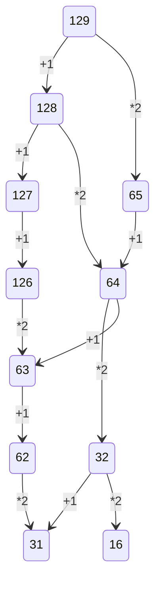

# Попова Анастасия 142

* [Морзянка.xlsx](https://github.com/oxxrayy/popova142/files/9670227/23232.xlsx) - морзянка - Exсel
* [Морзянка.py](https://github.com/Ethryna/popova142/blob/main/%D0%9C%D0%BE%D1%80%D0%B7%D1%8F%D0%BD%D0%BA%D0%B0.py) - морзянка - Python
* [Логика.xlsx](https://github.com/oxxrayy/popova142/files/9791381/default.xlsx) - таблицы по алгебре логики - Excel
* [cc.py](https://github.com/oxxrayy/popova142/files/9843668/cc.py) - перевод из десятичной СС в указанную - 
* [таблица умножения.xlsx](https://github.com/oxxrayy/popova142/files/9843674/default.xlsx) - таблица умнодения от 2 до 10 - Exel
* [Нейросеть](https://user-images.githubusercontent.com/114632258/197323136-85887533-005e-4662-b48a-3c61f61e7ad8.png) -  нейросеть для сложения и умножения - скриншот 
* [Алгоритм Хэминга](https://github.com/oxxrayy/popova142/files/9843692/default.py) - схема Горнера (не доделано) - Python
* [изменённая таблица со счетами за электричество для соответствия реальных затрат ожидаемым в Excel](https://user-images.githubusercontent.com/114632258/197323558-f4fd869f-cddb-48f0-b586-90ad784f583a.png) - изменённая таблица со счетами за электричество для соответствия реальных затрат ожидаемым в Excel - скриншот
* [логика пай.py](https://github.com/oxxrayy/popova142/files/9843707/default.py) - вычисление значений a, b и c, при которых значение логического выражения (A & не B -> C) <-> A равно 0 - Python
* [Np_в_N10.py.py](https://github.com/oxxrayy/popova142/files/9843712/Np_._N10.py.py) - перевод числа из указываемой СС в десятичную - Python
* [схема Горнера.py](https://github.com/oxxrayy/popova142/files/9843714/default.py) - схема Горнера (не доделано) - Python

$$(A \wedge  B \wedge   C = A \wedge  (B \wedge  C)$$

$$\bar{E}_1^{2}=\sqrt{\frac{Fa^{x-1}}{(x-1)\cdot x}} + \alpha_1^{\frac{1}{2}} + \beta_1^{\frac{2}{3}}$$

$$A=UIt+I^{2}Rt=\frac{U^{2}}{R}t$$

$$F=G\frac{m_{1}m_{2}}{R^{2}}$$

