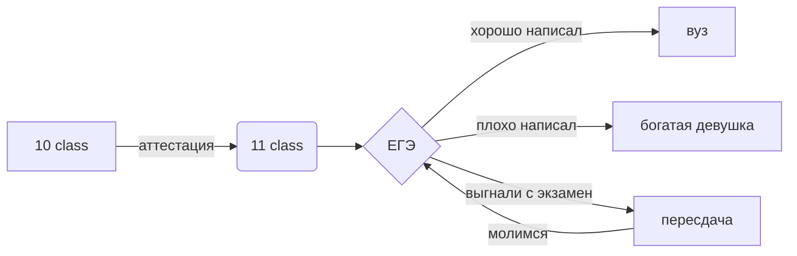

```mermaid 

flowchart LR
A[10 class] -->|аттестация| B(11 class)
B --> C{ЕГЭ}
C -->|хорошо написал| D[вуз]
C -->|плохо написал| E[богатая девушка]
C -->|выгнали с экзамен| F[пересдача]
F -->|молимся| C
```
